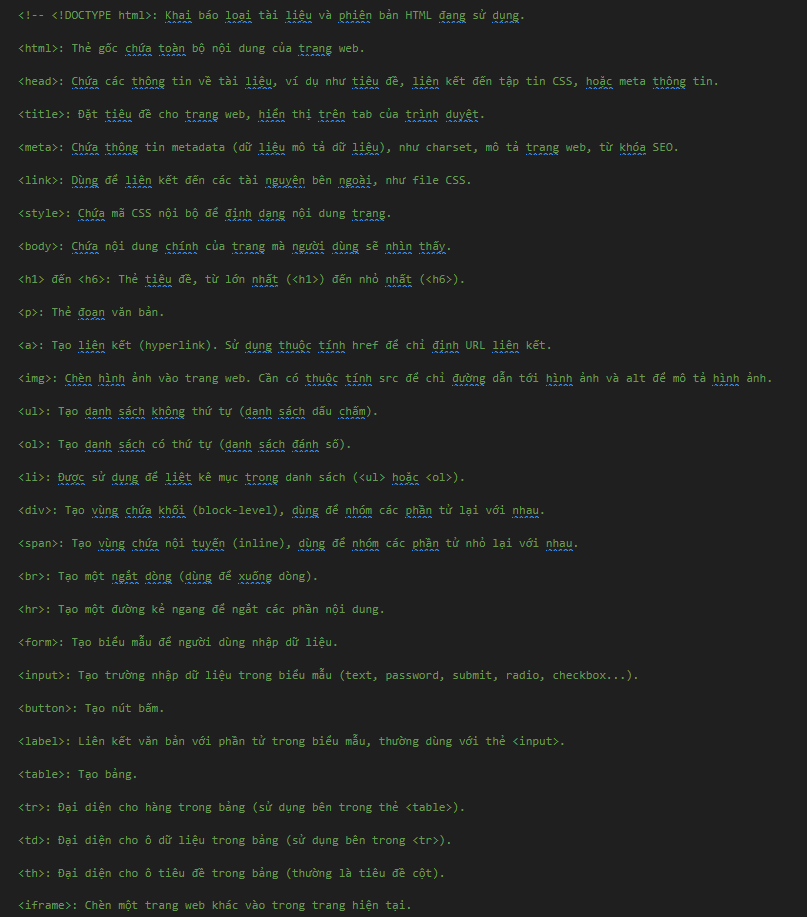

# Dưới đây là danh sách các thẻ HTML cơ bản thường được sử dụng:

<!-- <!DOCTYPE html>: Khai báo loại tài liệu và phiên bản HTML đang sử dụng.

<html>: Thẻ gốc chứa toàn bộ nội dung của trang web.

<head>: Chứa các thông tin về tài liệu, ví dụ như tiêu đề, liên kết đến tập tin CSS, hoặc meta thông tin.

<title>: Đặt tiêu đề cho trang web, hiển thị trên tab của trình duyệt.

<meta>: Chứa thông tin metadata (dữ liệu mô tả dữ liệu), như charset, mô tả trang web, từ khóa SEO.

<link>: Dùng để liên kết đến các tài nguyên bên ngoài, như file CSS.

<style>: Chứa mã CSS nội bộ để định dạng nội dung trang.

<body>: Chứa nội dung chính của trang mà người dùng sẽ nhìn thấy.

<h1> đến <h6>: Thẻ tiêu đề, từ lớn nhất (<h1>) đến nhỏ nhất (<h6>).

: Thẻ đoạn văn bản.

<a>: Tạo liên kết (hyperlink). Sử dụng thuộc tính href để chỉ định URL liên kết.

: Chèn hình ảnh vào trang web. Cần có thuộc tính src để chỉ đường dẫn tới hình ảnh và alt để mô tả hình ảnh.

<ul>: Tạo danh sách không thứ tự (danh sách dấu chấm).

<ol>: Tạo danh sách có thứ tự (danh sách đánh số).

<li>: Được sử dụng để liệt kê mục trong danh sách (<ul> hoặc <ol>).

: Tạo vùng chứa khối (block-level), dùng để nhóm các phần tử lại với nhau.

: Tạo vùng chứa nội tuyến (inline), dùng để nhóm các phần tử nhỏ lại với nhau.

 : Tạo một ngắt dòng (dùng để xuống dòng).

: Tạo một đường kẻ ngang để ngắt các phần nội dung.

<form>: Tạo biểu mẫu để người dùng nhập dữ liệu.

<input>: Tạo trường nhập dữ liệu trong biểu mẫu (text, password, submit, radio, checkbox...).

<button>: Tạo nút bấm.

<label>: Liên kết văn bản với phần tử trong biểu mẫu, thường dùng với thẻ <input>.

<table>: Tạo bảng.

<tr>: Đại diện cho hàng trong bảng (sử dụng bên trong thẻ <table>).

<td>: Đại diện cho ô dữ liệu trong bảng (sử dụng bên trong <tr>).

<th>: Đại diện cho ô tiêu đề trong bảng (thường là tiêu đề cột).

<iframe>: Chèn một trang web khác vào trong trang hiện tại.

<script>: Chèn hoặc nhúng mã JavaScript vào trang web.

<footer>: Định nghĩa phần chân trang của tài liệu.

<header>: Định nghĩa phần đầu trang của tài liệu hoặc một phần trong tài liệu.

Những thẻ này là nền tảng của HTML và giúp bạn xây dựng cấu trúc trang web. -->